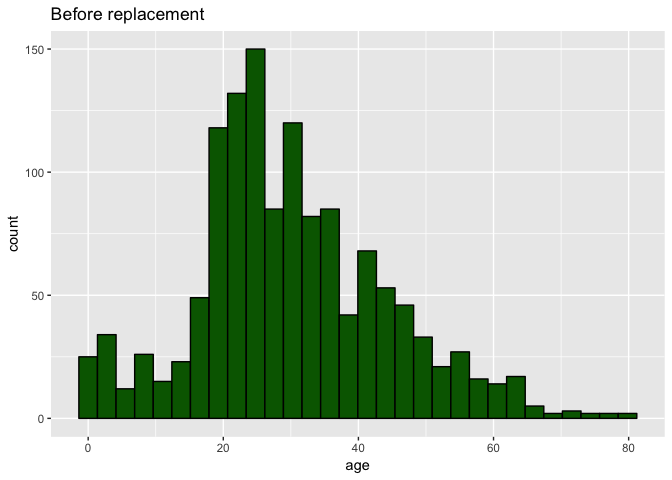
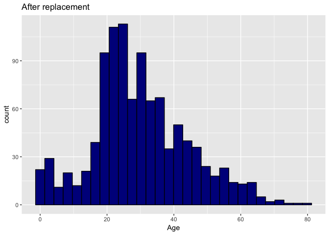
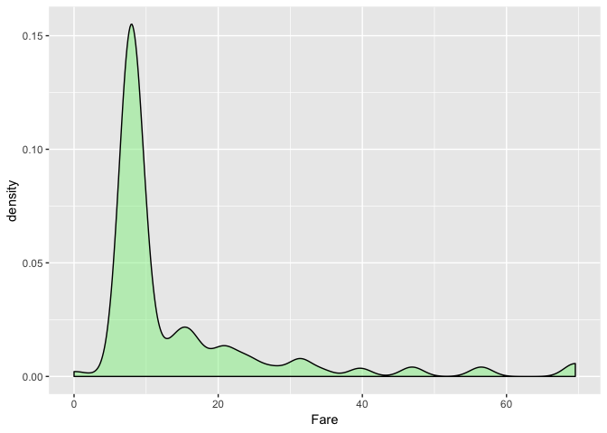
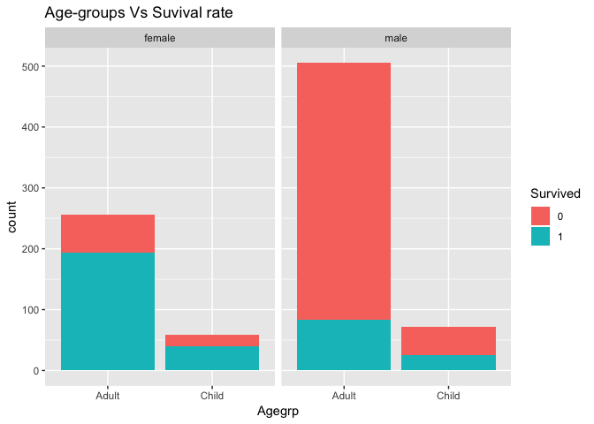
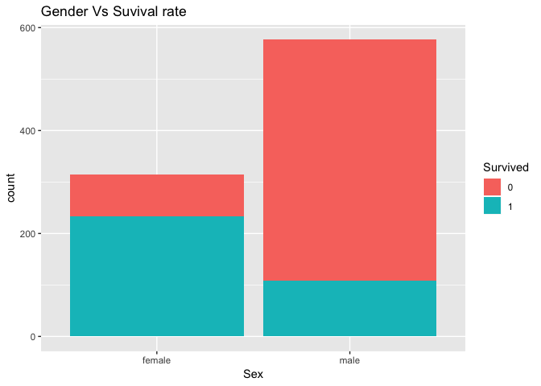
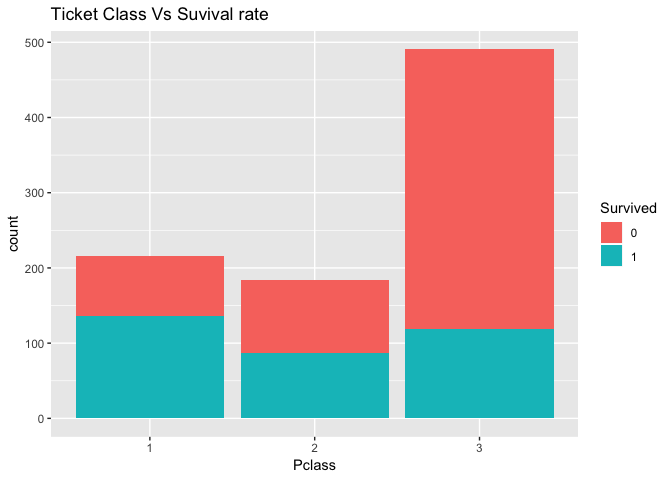
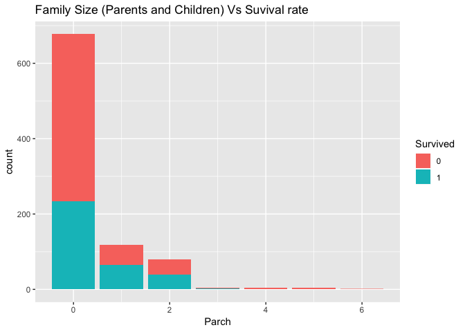
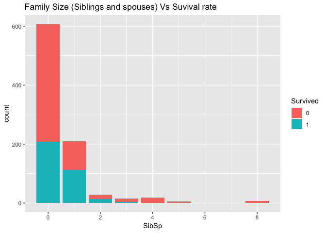
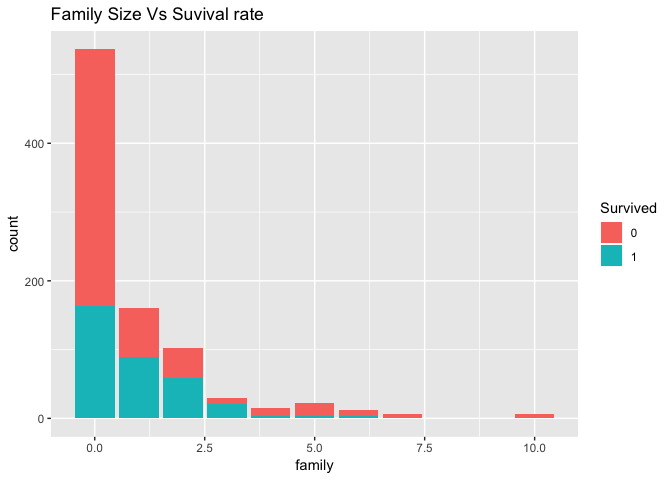
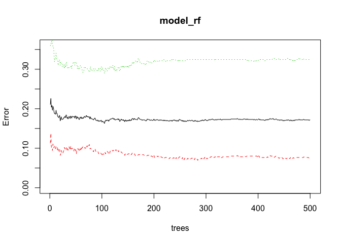

# Introduction
  
The sinking of the RMS Titanic is one of the most infamous shipwrecks in history. On April 15, 1912, during her maiden voyage, the Titanic sank after colliding with an iceberg, killing 1502 out of 2224 passengers and crew. This sensational tragedy shocked the international community and led to better safety regulations for ships.

One of the reasons that the shipwreck led to such loss of life was that there were not enough lifeboats for the passengers and crew. Although there was some element of luck involved in surviving the sinking, some groups of people were more likely to survive than others, such as women, children, and the upper-class.

In this challenge, we are going to complete the analysis of what sorts of people were likely to survive.

## Data Understanding

The data has been split into two groups:
  
training set (train.csv)
test set (test.csv)

The training set is used to build machine learning models. For the training set, we provide the outcome (also known as the “ground truth”) for each passenger. Your model will be based on “features” like passengers’ gender and class. You can also use feature engineering to create new features.

The test set should be used to see how well your model performs on unseen data. For the test set, we do not provide the ground truth for each passenger. It is your job to predict these outcomes. For each passenger in the test set, use the model you trained to predict whether or not they survived the sinking of the Titanic.

## Objective

This is my first stab at the titanic dataset. I will be doing missing value imputations, exploratory analysis,  feature engineering and prediction using random forests.

# Data cleaninig and imputation

## Load and Check Data


We have an idea of the data we are working with. So far we have 12 variables and 1309 observations. 891 observations from the train set and 418 observations from the test set.

Below is a description of the variables.

Survived      - Survived (1) or died (0).
Pclass        - Passenger's class.
Name          - Passenger's name.
Sex           - Passenger's sex.
Age           - Passenger's age.
SibSp         - Number of siblings/spouses aboard.
Parch         - Number of parents/children aboard.
Ticket        - Ticket number.
Fare          - Fare.
Cabin         - Cabin.
Embarked      - Port of embarkation.

## Missing values

Here we will find The Missing Values


```r
# Any missing data?
colSums(is.na(full))
```

```
## PassengerId    Survived      Pclass        Name         Sex         Age 
##           0         418           0           0           0         263 
##       SibSp       Parch      Ticket        Fare       Cabin    Embarked 
##           0           0           0           1           0           0
```

```r
# Age has 263 missing values, fare has 1 missing values. 

# Any empty data?

colSums(full == "")
```

```
## PassengerId    Survived      Pclass        Name         Sex         Age 
##           0          NA           0           0           0          NA 
##       SibSp       Parch      Ticket        Fare       Cabin    Embarked 
##           0           0           0          NA        1014           2
```

```r
# Cabin has 1014 empty values whereas embarked has 2.

# Visualise missing data
missmap(full, main = "Missing values vs observed")
```

<!-- -->

We have a lot of missing values for Cabin, since we won't be needing for our prediction we will drop it out of our dataset.

### Cabin

We will drop the Cabin variable as it is not useful for us


```r
# Drop the cabin variable
full$Cabin <- NULL
# check to see if variable has been removed
head(full,5) # it has been removed
```

```
##   PassengerId Survived Pclass
## 1           1        0      3
## 2           2        1      1
## 3           3        1      3
## 4           4        1      1
## 5           5        0      3
##                                                  Name    Sex Age SibSp
## 1                             Braund, Mr. Owen Harris   male  22     1
## 2 Cumings, Mrs. John Bradley (Florence Briggs Thayer) female  38     1
## 3                              Heikkinen, Miss. Laina female  26     0
## 4        Futrelle, Mrs. Jacques Heath (Lily May Peel) female  35     1
## 5                            Allen, Mr. William Henry   male  35     0
##   Parch           Ticket    Fare Embarked
## 1     0        A/5 21171  7.2500        S
## 2     0         PC 17599 71.2833        C
## 3     0 STON/O2. 3101282  7.9250        S
## 4     0           113803 53.1000        S
## 5     0           373450  8.0500        S
```

### Embarked

We will now impute teh missing values within the embarked Variable


```r
# Let us find the most common port so that we can impute it into the missing values
table(full$Embarked)
```

```
## 
##       C   Q   S 
##   2 270 123 914
```

```r
# it appears that S is the most common port

# Impute s into the missing values 
full[full$Embarked == "", "Embarked"] <- "S"

# Check to see what's changed 
table(full$Embarked)
```

```
## 
##   C   Q   S 
## 270 123 916
```

```r
# We don't have any missing values for Embarked anymore
```


### Age

We will now use random sampling to fill the missing Age values


```r
# Make new Age column
age <- full$Age
n = length(age)

# Replace missing value with a random sample from raw data
set.seed(1)
for(i in 1:n){
  if(is.na(age[i])){
    age[i] = sample(na.omit(full$Age),1)
  }
}

# Plot graph to see the effect of the change
ggplot(full, aes(age))+
  geom_histogram(fill="Dark Green", color = "Black") +
  labs(title="Before replacement") 
```

<!-- -->

```r
ggplot(full, aes(Age) ) +
  geom_histogram(fill="Dark Blue", color = "Black") +
  labs(title="After replacement")
```

<!-- -->

```r
full$Age <- age
colSums(is.na(full)) ###check
```

```
## PassengerId    Survived      Pclass        Name         Sex         Age 
##           0         418           0           0           0           0 
##       SibSp       Parch      Ticket        Fare    Embarked 
##           0           0           0           1           0
```

```r
# The are 0 missing values for age now.
```

### Fare 

We will use imputation to fill in fare values


```r
# Find out other information on the individual with now fare data
full[is.na(full$Fare),]
```

```
##      PassengerId Survived Pclass               Name  Sex  Age SibSp Parch
## 1044        1044       NA      3 Storey, Mr. Thomas male 60.5     0     0
##      Ticket Fare Embarked
## 1044   3701   NA        S
```

```r
# Passenger 1044 is from pclass 3 and has embarked from port 3
# Before we use the mean or median, we need to first have a look at the distribution 
ggplot(full[full$Pclass == '3' & full$Embarked == 'S', ], 
  aes(x = Fare)) +
  geom_density(fill = 'light green', alpha=0.5)
```

<!-- -->

```r
 # The data seems to be skewed to the right. 
 # In this case the median is the best approach to help us impute the Fare value

# So we use the Pclass and Embarked values to help us impute the Fare Value for passenger 1044.
full$Fare[1044] <- median(full[full$Pclass == '3' & full$Embarked == 'S', ]$Fare, na.rm = TRUE)

# Check to see if we have made any changes to the data.
full[1044,] # Yes we have!
```

```
##      PassengerId Survived Pclass               Name  Sex  Age SibSp Parch
## 1044        1044       NA      3 Storey, Mr. Thomas male 60.5     0     0
##      Ticket Fare Embarked
## 1044   3701 8.05        S
```

## Categorical Casting and Data Splitting


```r
# Make sure the variables are in the right structure
factor_vars <- c('PassengerId','Pclass','Sex','Embarked',
                 'Name', 'Survived')
full[factor_vars] <- lapply(full[factor_vars], function(x) as.factor(x))

# Split Data apart
# Split the train model
train.cl <- full[1:891,]

## plit the test model 
test.cl <- full[892:1309,]
# Check to see if it split right!
str(train.cl)
```

```
## 'data.frame':	891 obs. of  11 variables:
##  $ PassengerId: Factor w/ 1309 levels "1","2","3","4",..: 1 2 3 4 5 6 7 8 9 10 ...
##  $ Survived   : Factor w/ 2 levels "0","1": 1 2 2 2 1 1 1 1 2 2 ...
##  $ Pclass     : Factor w/ 3 levels "1","2","3": 3 1 3 1 3 3 1 3 3 2 ...
##  $ Name       : Factor w/ 1307 levels "Abbing, Mr. Anthony",..: 156 287 531 430 23 826 775 922 613 855 ...
##  $ Sex        : Factor w/ 2 levels "female","male": 2 1 1 1 2 2 2 2 1 1 ...
##  $ Age        : num  22 38 26 35 35 36 54 2 27 14 ...
##  $ SibSp      : int  1 1 0 1 0 0 0 3 0 1 ...
##  $ Parch      : int  0 0 0 0 0 0 0 1 2 0 ...
##  $ Ticket     : chr  "A/5 21171" "PC 17599" "STON/O2. 3101282" "113803" ...
##  $ Fare       : num  7.25 71.28 7.92 53.1 8.05 ...
##  $ Embarked   : Factor w/ 3 levels "C","Q","S": 3 1 3 3 3 2 3 3 3 1 ...
```

```r
str(test.cl)
```

```
## 'data.frame':	418 obs. of  11 variables:
##  $ PassengerId: Factor w/ 1309 levels "1","2","3","4",..: 892 893 894 895 896 897 898 899 900 901 ...
##  $ Survived   : Factor w/ 2 levels "0","1": NA NA NA NA NA NA NA NA NA NA ...
##  $ Pclass     : Factor w/ 3 levels "1","2","3": 3 3 2 3 3 3 3 2 3 3 ...
##  $ Name       : Factor w/ 1307 levels "Abbing, Mr. Anthony",..: 646 1278 845 1290 551 1168 262 186 10 309 ...
##  $ Sex        : Factor w/ 2 levels "female","male": 2 1 2 2 1 2 1 2 1 2 ...
##  $ Age        : num  34.5 47 62 27 22 14 30 26 18 21 ...
##  $ SibSp      : int  0 1 0 0 1 0 0 1 0 2 ...
##  $ Parch      : int  0 0 0 0 1 0 0 1 0 0 ...
##  $ Ticket     : chr  "330911" "363272" "240276" "315154" ...
##  $ Fare       : num  7.83 7 9.69 8.66 12.29 ...
##  $ Embarked   : Factor w/ 3 levels "C","Q","S": 2 3 2 3 3 3 2 3 1 3 ...
```


# Exploratory Analysis & Feature Training 

## Age Vs Survival


```r
# Create an age group column with Child & Adult

train.cl$Agegrp[train.cl$Age < 18] <- 'Child'
train.cl$Agegrp[train.cl$Age >= 18] <- 'Adult'

# Visualise the relationship between age group and Survival
ggplot(train.cl, aes(Agegrp,fill = Survived)) +
    geom_bar() +
   labs(title = "Age-groups Vs Suvival rate") +
   labs(xlab("Age-Group")) +
   labs(ylab("Count"))+
  facet_grid(.~Sex)
```

<!-- -->

```r
# Make a 2x2 table having Children as the reference group
tab.age <- table(train.cl$Agegrp, train$Survived)
tab.age
```

```
##        
##           0   1
##   Adult 484 277
##   Child  65  65
```

```r
# Check out the OR to see the strength of the association between Age group and suvival rate.
epi.2by2(tab.age, method="cohort.count")
```

```
##              Outcome +    Outcome -      Total        Inc risk *
## Exposed +          484          277        761              63.6
## Exposed -           65           65        130              50.0
## Total              549          342        891              61.6
##                  Odds
## Exposed +        1.75
## Exposed -        1.00
## Total            1.61
## 
## Point estimates and 95 % CIs:
## -------------------------------------------------------------------
## Inc risk ratio                               1.27 (1.06, 1.52)
## Odds ratio                                   1.75 (1.20, 2.54)
## Attrib risk *                                13.60 (4.35, 22.85)
## Attrib risk in population *                  11.62 (2.45, 20.79)
## Attrib fraction in exposed (%)               21.38 (5.87, 34.34)
## Attrib fraction in population (%)            18.85 (4.88, 30.77)
## -------------------------------------------------------------------
##  X2 test statistic: 8.684 p-value: 0.003
##  Wald confidence limits
##  * Outcomes per 100 population units
```

Children 1.75 times more likely to survive than adults, our 95% Confidence Interval is from 1.20 to 2.54.


## Sex Vs Survival 


```r
ggplot(train.cl, aes(Sex,fill = Survived)) +
    geom_bar() +
   labs(title = "Gender Vs Suvival rate") +
   labs(xlab("Gender")) +
   labs(ylab("Count"))
```

<!-- -->

```r
# Female survival rate appears to be greater then male survival rate.

# Odds Ratio and Chi2 test to see the likelihood of surival rate based on sex
# First, make a 2x2 table having Females as the referene group.
tab.sex <- table(train$Sex, train$Survived)
tab2.sex <- cbind(tab.sex[,2], tab.sex[,1]) 
colnames(tab2.sex) <- c("Survived", "Not Survived")
tab2.sex
```

```
##        Survived Not Survived
## female      233           81
## male        109          468
```

```r
#Now do the OR and chi2 test
epi.2by2(tab2.sex, method="cohort.count")
```

```
##              Outcome +    Outcome -      Total        Inc risk *
## Exposed +          233           81        314              74.2
## Exposed -          109          468        577              18.9
## Total              342          549        891              38.4
##                  Odds
## Exposed +       2.877
## Exposed -       0.233
## Total           0.623
## 
## Point estimates and 95 % CIs:
## -------------------------------------------------------------------
## Inc risk ratio                               3.93 (3.28, 4.71)
## Odds ratio                                   12.35 (8.90, 17.14)
## Attrib risk *                                55.31 (49.51, 61.11)
## Attrib risk in population *                  19.49 (14.98, 24.01)
## Attrib fraction in exposed (%)               74.54 (69.48, 78.76)
## Attrib fraction in population (%)            50.78 (43.87, 56.85)
## -------------------------------------------------------------------
##  X2 test statistic: 263.051 p-value: < 0.001
##  Wald confidence limits
##  * Outcomes per 100 population units
```

The odds of a female surviving is 12.4 times the odds of a male survivng and we can be 95% certain that this values lies between 8.9 & 17.1. From this we can say that there is a strong association between Gender and Survival.

## Pclass vs Suvival


```r
ggplot(train.cl, aes(Pclass,fill = Survived)) +
    geom_bar() +
   labs(title = "Ticket Class Vs Suvival rate") +
   labs(xlab("Ticket Class")) +
   labs(ylab("Count"))
```

<!-- -->

```r
# Those in the lower Pclasses have a higher survival rate than those in the lower Pclass.

# Family Size vs Survival
ggplot(train.cl, aes(x=Parch, fill=Survived)) +
  geom_histogram(stat = "count")+
  labs(title = "Family Size (Parents and Children) Vs Suvival rate") +
   labs(xlab("Family Size")) +
   labs(ylab("Count"))
```

<!-- -->

Suprisingly those with smaller family size have a lower survival rate compared to this bigger family size.

##  Family Size vs Suvival


```r
ggplot(train.cl, aes(x=SibSp, fill=Survived)) +
  geom_histogram(stat = "count") +
  labs(title = "Family Size (Siblings and spouses) Vs Suvival rate") +
   labs(xlab("Family Size")) +
   labs(ylab("Count"))
```

<!-- -->

```r
# Since Pclass SibSp are similiar and have the same distribution, we can cobine them together.

family <- train.cl$SibSp + train.cl$Parch

ggplot(train.cl, aes(x=family, fill=Survived)) +
  geom_histogram(stat = "count") +
  labs(title = "Family Size Vs Suvival rate") +
   labs(xlab("Family Size")) +
   labs(ylab("Count"))        
```

<!-- -->

```r
# Those with little to none family members appear have a higher survival rate than those with bigger families.
```

# Machine learning

## Model building

Here we build the model using random forest on our training tes.


```r
# random seed 
set.seed(992)

# deploy your model
model_rf <- randomForest(factor(Survived) ~ Pclass + Sex + Age + SibSp + Parch + 
                                            Fare + Embarked, data = train.cl)

# Graph model error
plot(model_rf, ylim=c(0,0.36))
```

<!-- -->

Red line shows error rate for 'died, green line shows error rate for 'survived' and the black line shows the overall error rate. With around 10% our model seems to be good at predicting death than survival.


## Prediction

Let's get into our final step. Here we apply our model onto the test dataset. The results are saved and written on a csv containing two columns 'Passenger Id' and 'Survived'(what we are predicting)


```r
# Use the test data to make a prediction
prediction <- predict(model_rf, test.cl)

# Save the solution to a dataframe and write the solutuion into an excel file
solution <- data.frame(PassengerID = test.cl$PassengerId, Survived = prediction)
write.csv(solution, file = 'rf_mod_Solution.csv', row.names = F)
```
